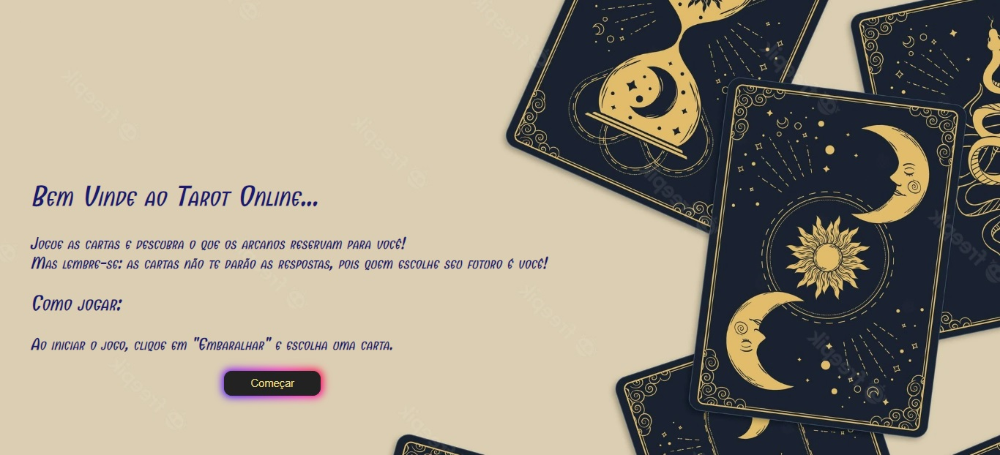
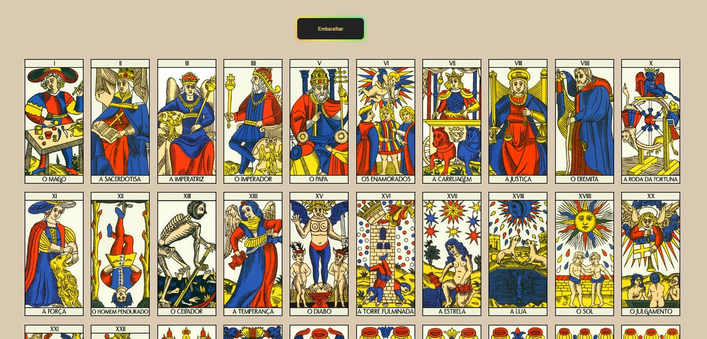
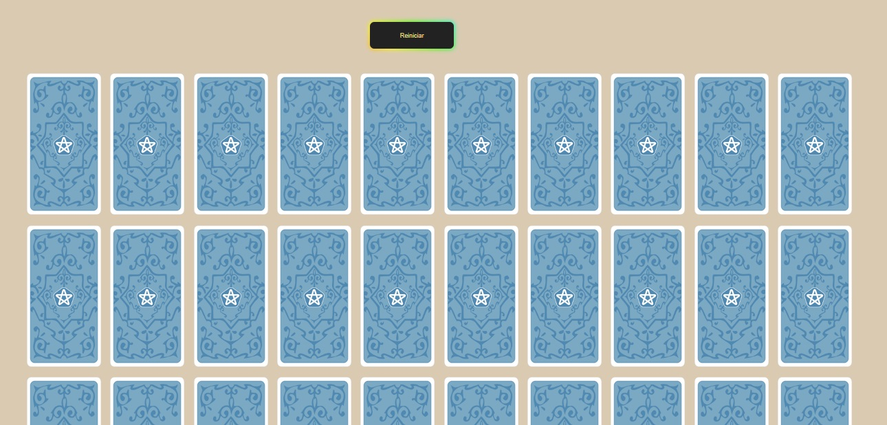
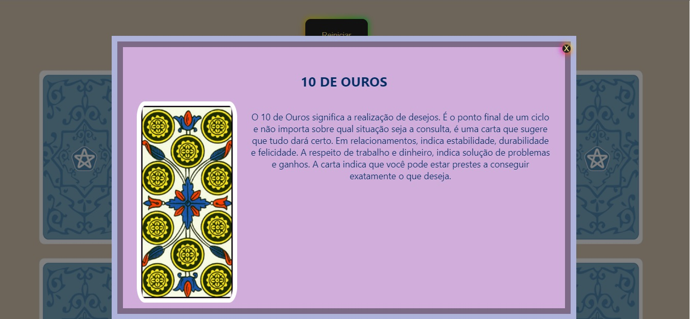

# JOGO DO TAROT
👨‍🏫É UM JOGO DE CARTAS TRADICIONAL JOGADO COM UM BARALHO DE TAROT, QUE É UM BARALHO ESPECIAL COM 78 CARTAS.

 <br> 
 <br> 
 <br> 
 <br> 

## DESCRIÇÃO:
Este projeto refere-se a um jogo online de tarot com a exibição visual das cartas. Assim que o usuário clica no botão -embaralhar- as cartas são misturadas e distribuídas na tela viradas para baixo. Em seguida o usário deve escolher uma carta, a qual é revelada trazendo sua mensagem.

## SOBRE O JOGO:
O **Jogo do Tarot** é um jogo de cartas tradicional jogado com um baralho de tarot, que é um baralho especial com 78 cartas. O jogo é popular em várias regiões, especialmente na França, e pode ser jogado de diferentes maneiras. 

O Jogo do Tarot é um jogo de cartas que combina elementos de trunfo, estratégia e blefe. O baralho de tarot usado contém 78 cartas divididas em Arcanos Maiores (22 cartas) e Arcanos Menores (56 cartas). O objetivo do jogo é acumular pontos através de várias rodadas, conhecidas como "mãos".

- **Arcanos Maiores (22 cartas):** Incluem cartas como O Mago, A Imperatriz, O Louco, etc. Estas cartas têm um valor específico e podem agir como trunfos.
- **Arcanos Menores (56 cartas):** Divididos em quatro naipes (Copas, Espadas, Ouros e Paus), cada naipe tem cartas numeradas de 1 a 10 e quatro figuras (Valete, Cavaleiro, Rainha e Rei).

## EXECUTANDO O PROJETO:
1. **Instalar as dependências do projeto**:
   - Execute o comando no diretório `CODIGO/`:
     ```cmd
     npm install
     ```
   
   - Este comando instala todas as dependências listadas no arquivo `package.json` do seu projeto. 

2. **Executando o Aplicativo:**
   - Ainda no diretório `CODIGO/`, abra o terminal ou prompt de comando e digite o seguinte comando:
   ```bash
   npm start
   ```
   - Acesse o aplicativo no navegador visitando [http://localhost::3000/](http://localhost::3000/).

## COMO JOGAR?
1. **Preparação:**
   - O jogo é jogado por quatro jogadores, que podem se dividir em duas equipes de dois jogadores cada. O baralho de tarot é bem embaralhado e cada jogador recebe uma mão de 18 cartas, enquanto as cartas restantes formam o "monto".

2. **Objetivo:**
   - O objetivo é ganhar o maior número de pontos possível através das mãos jogadas. O jogador ou a equipe que acumular mais pontos no final do jogo vence.

3. **Distribuição de Cartas:**
   - Cada jogador recebe 18 cartas, e as cartas restantes são colocadas em um monte central. Durante o jogo, cada jogador pode "comprar" as cartas do monte para melhorar sua mão.

4. **Jogabilidade:**
   - **Trunfo:** As cartas de Arcanos Maiores e algumas cartas dos Arcanos Menores podem agir como trunfos, superando outras cartas.
   - **Jogadas:** Cada jogador joga uma carta por vez, e a carta mais alta (ou trunfo) vence a rodada. A carta vencedora é colocada na pilha de pontos do jogador ou equipe que a ganhou.
   - **Contratos:** Antes de começar uma mão, o jogador pode fazer uma "aposta" ou "contrato", que determina a quantidade de pontos que ele deve ganhar naquela mão para obter uma pontuação extra. Isso adiciona um elemento estratégico e de blefe ao jogo.

5. **Pontuação:**
   - **Cartas de Pontos:** Algumas cartas têm valores específicos e contribuem para a pontuação final. Os Arcanos Maiores são geralmente mais valiosos.
   - **Contagem de Pontos:** No final de cada mão, os pontos são contados com base nas cartas ganhas e contratos cumpridos. O objetivo é acumular mais pontos do que os adversários.

6. **Estratégia:**
   - **Gerenciamento de Mão:** Os jogadores devem jogar suas cartas estrategicamente, considerando quais cartas têm trunfo e quais têm valor alto.
   - **Contratos e Blefe:** Fazer contratos ousados pode ser arriscado, mas também pode levar a grandes recompensas. Blefar e ler os movimentos dos adversários são partes importantes da estratégia.

7. **Final do Jogo:**
   - O jogo é geralmente jogado em várias mãos, e o vencedor é o jogador ou equipe que acumula o maior número de pontos ao final do jogo.

**Dicas Adicionais:**
   - **Compreensão das Cartas:** Conheça o valor das cartas e os efeitos especiais dos Arcanos Maiores.
   - **Observação:** Preste atenção nas cartas jogadas pelos outros jogadores para prever suas estratégias.   

## NÃO SABE?
- Entendemos que para manipular arquivos em `HTML`, `CSS` e outras linguagens relacionadas, é necessário possuir conhecimento nessas áreas. Para auxiliar nesse aprendizado, oferecemos cursos gratuitos disponíveis:
* [CURSO DE HTML E CSS](https://github.com/VILHALVA/CURSO-DE-HTML-E-CSS)
* [CURSO DE JAVASCRIPT](https://github.com/VILHALVA/CURSO-DE-JAVASCRIPT)
* [CURSO DE NODEJS](https://github.com/VILHALVA/CURSO-DE-NODEJS)
* [CURSO DE REACT](https://github.com/VILHALVA/CURSO-DE-REACT)
* [CONFIRA MAIS CURSOS](https://github.com/VILHALVA?tab=repositories&q=+topic:CURSO)

## CREDITOS:
- [PROJETO CRIADO PELO "caroliniconstantino"](https://github.com/caroliniconstantino/jogo-tarot)
- [PROJETO EDITADO PELO VILHALVA](https://github.com/VILHALVA)
